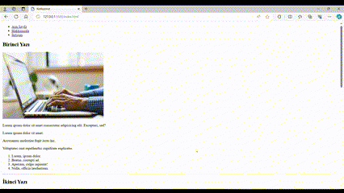

# Patika HTML Course - End-of-Section Project
I prepared this project to implement what our instructor covered in the 'End-of-Section Exercise' part of the class.

The project includes three different pages:

 * home 
 * about us 
 * contact 
 
There are links both above and below all pages to navigate to these sections.

The appearance of the website I created is shown below: 

